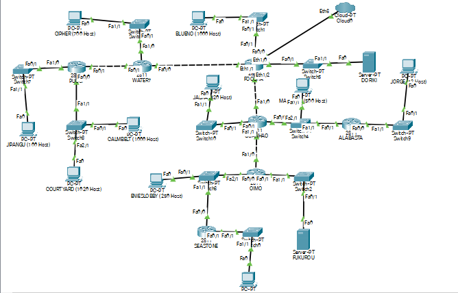
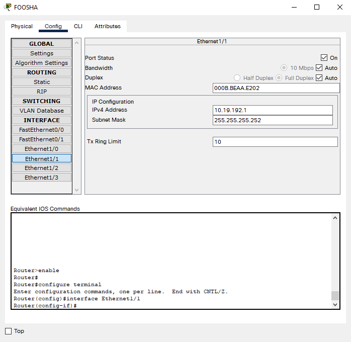
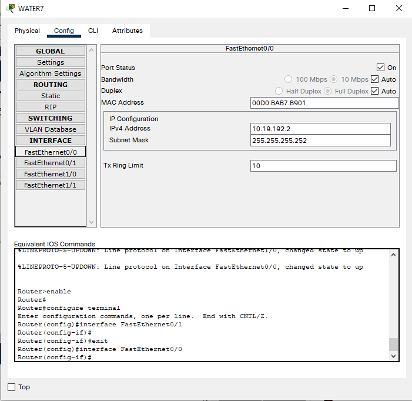
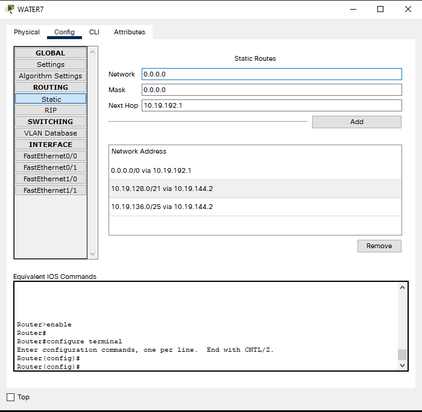
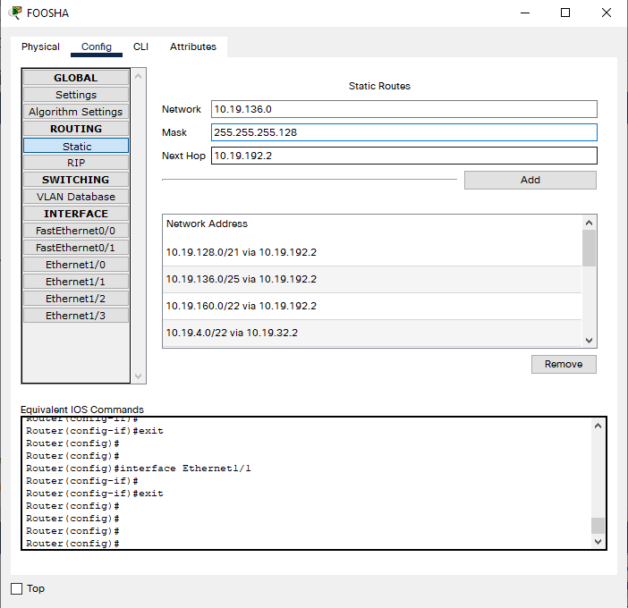
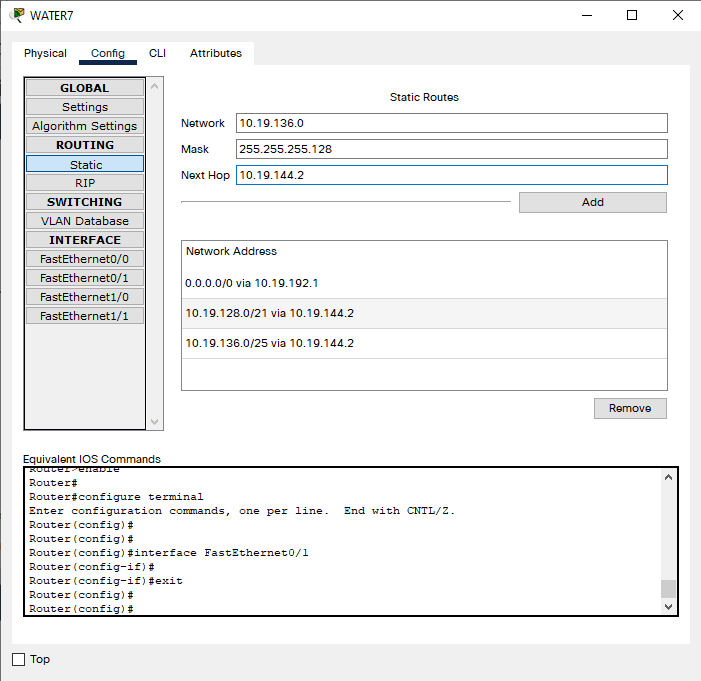
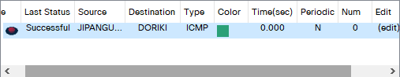
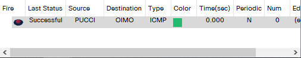
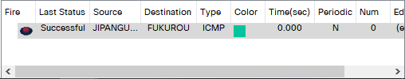
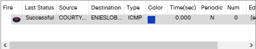

# Jarkom-Modul-4-C10-2021

## Anggota Kelompok C10
| Nama | NRP |
| ------------- | ------------- |
| Christian Bennett Robin | 05111940000078  |
| Erza Janitradevi Nadine  | 05111940000153  |
| Akmal Zaki Asmara  | 05111940000154  |

## VLSM (Variable Length Subnet Masking) - CPT

### Perhitungan Subnet

#### Langkah 1 

Pertama-tama jumlah alamat IP yang dibutuhkan ditentukan untuk tiap subnet dan dilakukan labelling netmask berdasarkan jumlah IP yang dibutuhkan.

| Subnet | Jumlah IP | Netmask |	
|:------:|:---------:|:-------:|	
|   A1   |    2021   |   /21   |	
|   A2   |    101    |   /25   |	
|   A3   |     2     |   /30   |	
|   A4   |    701    |   /22   |	
|   A5   |     2     |   /30   |	
|   A6   |    1001   |   /22   |	
|   A7   |     2     |   /30   |	
|   A8   |    521    |   /22   |	
|   A9   |     2     |   /30   |	
|   A10  |    252    |   /24   |	
|   A11  |    721    |   /22   |	
|   A12  |    502    |   /23   |	
|   A13  |     13    |   /28   |	
|   A14  |     2     |   /30   |	
|   A15  |     2     |   /30   |	

Berdasarkan total IP dan netmask yang dibutuhkan, maka kita dapat menggunakan netmask /20 (1 diatas netmask paling besar, yaitu /21) untuk memberikan pengalamatan IP pada subnet.

#### Langkah 2 

Awalnya, subnet besar yang dibentuk memiliki NID 10.19.0.0 dengan netmask /20, namun karena subnet /20 tidak muat dikarenakan kita memperlukan 4 netmask /22, maka netmask diperbesar sampai kita mendapatkan 4 netmask /22, akhirnya kita akan menggunakan netmask /19. Lalu pembagian IP berdasarkan NID dan netmask tersebut dihitung dan setelah itu bisa langsung kita lanjuti dengan subnetting. Hasil pohon pun akan menjadi seperti ini:


#### Langkah 3

Dilakukan pembaagian IP sehingga didapati tabel dibawah ini:

|  A1 | Network ID        | 10.19.24.0      |	
|:---:|-------------------|-----------------|	
|     | Netmask           | 255.255.248.0   |	
|     | Broadcast Address | 10.19.31.255    |	
|  A2 | Network ID        | 10.19.0.128     |	
|     | Netmask           | 255.255.255.128 |	
|     | Broadcast Address | 10.19.0.255     |	
|  A3 | Network ID        | 10.19.0.0       |	
|     | Netmask           | 255.255.255.252 |	
|     | Broadcast Address | 10.19.0.3       |	
|  A4 | Network ID        | 10.19.4.0       |	
|     | Netmask           | 255.255.252.0   |	
|     | Broadcast Address | 10.19.7.255     |	
|  A5 | Network ID        | 10.19.0.4       |	
|     | Netmask           | 255.255.255.252 |	
|     | Broadcast Address | 10.19.0.7       |	
|  A6 | Network ID        | 10.19.8.0       |	
|     | Netmask           | 255.255.252.0   |	
|     | Broadcast Address | 10.19.11.255    |	
|  A7 | Network ID        | 10.19.0.8       |	
|     | Netmask           | 255.255.255.252 |	
|     | Broadcast Address | 10.19.0.11      |	
|  A8 | Network ID        | 10.19.12.0      |	
|     | Netmask           | 255.255.252.0   |	
|     | Broadcast Address | 10.19.15.255    |	
|  A9 | Network ID        | 10.19.0.12      |	
|     | Netmask           | 255.255.255.252 |	
|     | Broadcast Address | 10.19.0.15      |	
| A10 | Network ID        | 10.19.1.0       |	
|     | Netmask           | 255.255.255.0   |	
|     | Broadcast Address | 10.19.1.255     |	
| A11 | Network ID        | 10.19.16.0      |	
|     | Netmask           | 255.255.252.0   |	
|     | Broadcast Address | 10.11.19.255    |	
| A12 | Network ID        | 10.19.2.0       |	
|     | Netmask           | 255.255.254.0   |	
|     | Broadcast Address | 10.19.3.255     |	
| A13 | Network ID        | 10.19.0.32      |	
|     | Netmask           | 255.255.255.240 |	
|     | Broadcast Address | 10.19.0.47      |	
| A14 | Network ID        | 10.19.0.64      |	
|     | Netmask           | 255.255.255.252 |	
|     | Broadcast Address | 10.19.0.67      |	
| A15 | Network ID        | 10.19.0.68      |	
|     | Netmask           | 255.255.255.252 |	
|     | Broadcast Address | 10.19.0.71      |	

Berikut merupakan gambar topologi yang telah disubnetting:


### Routing

#### Subnetting

Pertama-tama, topologi dibuat dalam GNS3.


Lalu setiap node dikonfigurasi dengan cara `Configure > Edit Network Configuration`. Berikut merupakan salah satu contoh, yaitu menggunakan node `Foosha`:

Pada `Edit Network Configuration` Foosha, isi konfigurasi masing-masing jalur berdasarkan subnetting yang sudah dibuat sebelumnya:

```
# Static config for eth0
auto eth0
iface eth0 inet static
	address 10.19.8.1
	netmask 255.255.252.0

# Static config for eth1
auto eth1
iface eth1 inet static
	address 10.19.0.5
	netmask 255.255.255.252

# Static config for eth2
auto eth2
iface eth2 inet static
	address 10.19.0.65
	netmask 255.255.255.252

# Static config for eth3
auto eth3
iface eth3 inet static
	address 10.19.0.9
	netmask 255.255.255.252

# Static config for eth4
auto eth4
iface eth4 inet static
	address 192.168.122.2
	netmask 255.255.255.0
	gateway 192.168.122.1
```

Misal, karena disini `eth0` mengarah ke `Blueno (1000 Host)`, maka kita menggunakan subnet A6 dengan NID `10.19.8.0`. Pada konfigurasi `Foosha`, address untuk `eth0`-nya ditambahi 1 dari NID subnet A6 hingga menjadi `10.19.8.1`. Untuk kliennya, yaitu `Blueno (1000 Host)`, address untuk `eth0`-nya ditambahi 1 lagi dari IP Foosha sehingga menjadi `10.19.8.2`. Untuk netmasknya mengikuti tabel yang telah dibuat sebelumnya. Gateway hanya digunakan untuk klien dan server dan mengarah ke IP router terdekat, jadi gateway untuk klien `Blueno (1000 Host)` adalah `10.19.8.1`.

Hal ini dilakukan pada semua node dan subnetting pun selesai.

#### Routing

Terdapat 2 macam Routing yang dilakukan yaitu untuk antar router dan untuk router ke klien.

##### Antar Router

Untuk antar router, dilakukan Default Routing pada setiap router yang bukan `Foosha` yang arahnya dari router yang lebih jauh dari `Foosha` ke yang lebih dekat ke `Foosha`. Misal, dari `Pucci` dilakukan Default Routing ke `Water7`, maka ditambahkan kode berikut pada `Pucci`:

```
route add -net 0.0.0.0 netmask 0.0.0.0 gateway 10.19.0.1
```

Karena merupakan default routing, maka NID dan Netmasknya 0.0.0.0, sedangkan gatewaynya merupakan IP dari `eth1`-nya `Water7`.

Hal ini dilakukan pada semua router yang bukan `Foosha`.

##### Router ke Klien

Untuk router ke klien, dilakukan routing dari router `Foosha` ke NID dan Netmask dari klien berdasarkan subnetting yang telah dilakukan. Misal dilakukan routing dari `Foosha` ke klien `Jipangu`, maka ditambahkan kode berikut pada `Foosha`:

```
route add -net 10.19.0.128 netmask 255.255.255.128 gateway 10.19.0.6
```

NID `10.19.0.128` dan Netmask `255.255.255.128` didapatkan berdasarkan tabel subnetting sedangkan gateway `10.19.0.6` merupakan IP `eth2`-nya dari `Water7`, dikarenakan untuk mencapai klien `Jipangu` perlu melalui router `Water7`.

Hal ini dilakukan untuk semua klien.

Pada akhirnya akan didapatkan kode untuk routing pada setiap router sebagai berikut:

Water7:

```
route add -net 0.0.0.0 netmask 0.0.0.0 gateway 10.19.0.5
route add -net 10.19.24.0 netmask 255.255.248.0 gateway 10.19.0.2
route add -net 10.19.0.128 netmask 255.255.255.128 gateway 10.19.0.2
```

Pucci:

```
route add -net 0.0.0.0 netmask 0.0.0.0 gateway 10.19.0.1
```

Guanhao:

```
route add -net 0.0.0.0 netmask 0.0.0.0 gateway 10.19.0.9
route add -net 10.19.0.16 netmask 255.255.255.240 gateway 10.19.2.3
route add -net 10.19.1.0 netmask 255.255.255.0 gateway 10.19.0.14
route add -net 10.19.32.0 netmask 255.255.252.0 gateway 10.19.0.14
route add -net 10.19.0.68 netmask 255.255.255.252 gateway 10.19.0.14
```

Alabasta:

```
route add -net 0.0.0.0 netmask 0.0.0.0 gateway 10.19.2.1
```

Oimo:

```
route add -net 0.0.0.0 netmask 0.0.0.0 gateway 10.19.0.13
route add -net 10.19.16.0 netmask 255.255.252.0 gateway 10.19.1.3
```

Seastone:

```
route add -net 0.0.0.0 netmask 0.0.0.0 gateway 10.19.1.1
```

Foosha:

```
route add -net 11.19.24.0 netmask 255.255.248.0 gateway 10.19.0.6
route add -net 10.19.0.128 netmask 255.255.255.128 gateway 10.19.0.6
route add -net 10.19.4.0 netmask 255.255.252.0 gateway 10.19.0.6
route add -net 10.19.0.0 netmask 255.255.255.252 gateway 10.19.0.6

route add -net 10.19.12.0 netmask 255.255.252.0 gateway 10.19.0.10
route add -net 10.19.1.0 netmask 255.255.255.0 gateway 10.19.0.10
route add -net 10.19.16.0 netmask 255.255.252.0 gateway 10.19.0.10
route add -net 10.19.2.0 netmask 255.255.254.0 gateway 10.19.0.10
route add -net 10.19.0.32 netmask 255.255.255.240 gateway 10.19.0.10
route add -net 10.19.0.68 netmask 255.255.255.252 gateway 10.19.0.10
route add -net 10.19.0.12 netmask 255.255.255.252 gateway 10.19.0.10
```

Routing pun selesai dilakukan dan langkah terakhir merupakan Testing.

#### Testing

Pertama-tama jangan lupa untuk menambahkan kode ini pada `Foosha`:

```
iptables -t nat -A POSTROUTING -o eth4 -j MASQUERADE -s 10.19.0.0/19
```

Selain itu jangan lupa untuk menambahkan kode ini juga pada setiap node agar dapat terhubung ke internet:

```
echo nameserver 192.168.122.1 > /etc/resolv.conf
```

Setup pun selesai dan kita bisa melakukan testing ping antar node, berikut merupakan beberapa contoh ping:

1. Server Doriki ke Server Fukurou


2. Server Doriki ke Router Pucci


3. Server Doriki ke Klien Calmbelt


4. Server Doriki ke my.its.ac.id


## CIDR (Classless Inter Domain Routing) - CISCO
### Perhitungan Subnet

Pada subnetting menggunakan perhitungan CIDR ini, terdapat 6 langkah penggabungan subnet yang kami lakukan. Penggabungan subnet tersebut dimulai dari subnet terkecil.
#### Langkah 1


#### Langkah 2


#### Langkah 3


#### Langkah 4


#### Langkah 5


#### Langkah 6


### Pembagian IP

Berdasarkan perhitungan subnet dan penggabungan subnet yang telah dilakukan, didapatkan subnet terbesar G1 dengan netmask /16. Sehingga didapatkan pembagian IP yang diilustrasikan dengan tree pada gambar berikut ini. 


#### Tabel Pembagian IP

Berikut adalah tabel pembagian IP untuk subnet A1 hingga A15, yang berisi Network ID, Netmask, dan Broadcast Address.


|  A1 |Network ID        | 192.168.128.0   |	
|:---:|-------------------|-----------------|	
|     | Netmask           | 255.255.248.0   |	
|     | Broadcast Address | 192.168.135.255 |	
|  A2 | Network ID        | 192.168.136.0   |	
|     | Netmask           | 255.255.255.128 |	
|     | Broadcast Address | 192.168.136.127 |	
|  A3 | Network ID        | 192.168.160.0   |	
|     | Netmask           | 255.255.252.0   |	
|     | Broadcast Address | 192.168.163.255 |	
|  A4 | Network ID        | 192.168.64.0    |	
|     | Netmask           | 255.255.252.0   |	
|     | Broadcast Address | 192.168.67.255  |	
|  A5 | Network ID        | 192.168.4.0     |	
|     | Netmask           | 255.255.252.0   |	
|     | Broadcast Address | 192.168.7.255   |	
|  A6 | Network ID        | 192.168.0.0     |	
|     | Netmask           | 255.255.254.0   |	
|     | Broadcast Address | 192.168.1.255   |	
|  A7 | Network ID        | 192.168.2.0     |	
|     | Netmask           | 255.255.255.240 |	
|     | Broadcast Address | 192.168.2.15    |	
|  A8 | Network ID        | 192.168.8.0     |	
|     | Netmask           | 255.255.252.0   |	
|     | Broadcast Address | 192.168.11.255  |	
|  A9 | Network ID        | 192.168.12.0    |	
|     | Netmask           | 255.255.255.0   |	
|     | Broadcast Address | 192.168.12.255  |	
| A10 | Network ID        | 192.168.144.0   |	
|     | Netmask           | 255.255.255.252 |	
|     | Broadcast Address | 192.168.144.3   |	
| A11 | Network ID        | 192.168.192.0   |	
|     | Netmask           | 255.255.255.252 |	
|     | Broadcast Address | 192.168.192.3   |	
| A12 | Network ID        | 192.168.32.0    |	
|     | Netmask           | 255.255.255.252 |	
|     | Broadcast Address | 192.168.32.3    |	
| A13 | Network ID        | 192.168.16.0    |	
|     | Netmask           | 255.255.255.252 |	
|     | Broadcast Address | 192.168.16.3    |	
| A14 | Network ID        | 192.168.96.0    |	
|     | Netmask           | 255.255.255.252 |	
|     | Broadcast Address | 192.168.96.3    |	
| A15 | Network ID        | 192.168.16.4    |	
|     | Netmask           | 255.255.255.252 |	
|     | Broadcast Address | 192.168.16.7    |	


### Topologi CPT

Setelah melakukan penghitungan, buat topologi sesuai soal pada CPT.



Lalu, diperlukan setting IP dan subnet mask pada interface masing masing node. IP dan subnet mask harus sesuai hasil perhitungan dari subnetting yang telah dilakukan.

Untuk router, setting IP dan subnet mask dapat dilakukan dengan double click node > Config > Interface. Sedangkan pada host bisa dilakukan dengan double click node > Desktop > IP Configuration

Berikut adalah salah satu contoh konfigurasi interface pada router Foosha yang tersambung dengan router Water7 melalui interface ethernet 1 pada Foosha dan fast ethernet 0 pada Water7





IP pada masing masing interface mengikuti penghitungan subnetting yaitu subnet A11

Penyettingan IP dan subnet mask ini dilakukan pada seluruh node.

### Routing

Routing pada CPT dapat dilakukan dengan double click node router > Config > Routing > Static

#### Default Routing

Default Routing dilakukan pada setiap router selain main router yaitu Foosha. Default router dilakukan pada router yang berada pada tingkatan lebih bawah dan mengarah pada router diatasnya.

Salah satu contohnya adalah pada router Water7 ke router Foosha.



Untuk default routing, network dan mask akan diisi 0.0.0.0 . Sedangkan next hop diisi dengan interface dari router diatasnya yaitu router Foosha yang terkoneksi dengan router yang ingin dilakukan default routing

#### Static Routing

Static Routing dilakukan agar router dapat terhubung dengan client. Static Routing pada suatu client harus dilakukan pada setiap router yang dilalui oleh koneksi client ke main router dan selain router yang berada satu subnet dengan client.

Salah satu contohnya adalah apabila kita ingin mengkoneksikan Foosha dengan Jipangu, maka kita perlu melakukan static routing pada router Foosha dan Water7 saja. Pucci tidak perlu static routing karena satu subnet dengan Jipangu, jadi seharusnya sudah dapat terkoneksi tanpa routing.

Berikut adalah konfigurasi routing Foosha dan Water7




Pada Foosha, network dan mask yang dipakai adalah NID dan subnet mask dari subnet yang akan dihubungkan yaitu subnet milik Jipangu. Sedangkan next hop merupakan interface milik router dibawahnya yang terhubung dengan router yang akan dirouting, pada kasus ini interface yang dipakai merupakan interface dari Water7 yang terhubung dengan Foosha. Hal ini juga dilakukan pada router Water7.

Berikut adalah list routing pada masing masing router

Foosha : 
- 10.19.128.0/21 via 10.19.192.2
- 10.19.136.0/25 via 10.19.192.2
- 10.19.160.0/22 via 10.19.192.2
- 10.19.4.0/22 via 10.19.32.2
- 10.19.0.0/23 via 10.19.32.2
- 10.19.2.0/28 via 10.19.32.2
- 10.19.12.0/24 via 10.19.32.2
- 10.19.8.0/22 via 10.19.32.2
- 10.19.16.4/30 via 10.19.32.2
- 10.19.144.0/30 via 10.19.192.2
- 10.19.16.0/30 via 10.19.32.2

Water7 : 
- 0.0.0.0/0 via 10.19.192.1
- 10.19.128.0/21 via 10.19.144.2
- 10.19.136.0/25 via 10.19.144.2

Pucci : 
- 0.0.0.0/0 via 10.19.144.1

Guanhao : 
- 0.0.0.0/0 via 10.19.32.1
- 10.19.2.0/28 via 10.19.0.3
- 10.19.12.0/24 via 10.19.16.2
- 10.19.8.0/22 via 10.19.16.2
- 10.19.16.4/30 via 10.19.16.2

Alabasta : 
- 0.0.0.0/0 via 10.19.0.1

Oimo : 
- 0.0.0.0/0 via 10.19.16.1
- 10.19.8.0/22 via 10.19.12.3

Seastone : 
- 0.0.0.0/0 via 10.19.12.1


### Testing

Testing pada CPT dapat dilakukan dengan tombol Add Simple PDU yang dilambangkan dengan icon pesan pada top navigation.

1. Jipangu - Doriki
   
2. Pucci - Oimo
   
3. Jipangu - Fukurou
   
4. Courtyard - Enieslobby
   