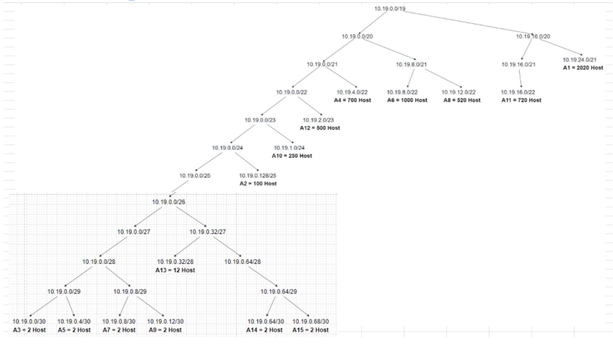

# Jarkom-Modul-4-C10-2021

## Anggota Kelompok C10
| Nama | NRP |
| ------------- | ------------- |
| Christian Bennett Robin | 05111940000078  |
| Erza Janitradevi Nadine  | 05111940000153  |
| Akmal Zaki Asmara  | 05111940000154  |

## VLSM (GNS3)

### Perhitungan Subnet

#### Langkah 1 

Pertama-tama jumlah alamat IP yang dibutuhkan ditentukan untuk tiap subnet dan dilakukan labelling netmask berdasarkan jumlah IP yang dibutuhkan.

| Subnet | Jumlah IP | Netmask |	
|:------:|:---------:|:-------:|	
|   A1   |    2021   |   /21   |	
|   A2   |    101    |   /25   |	
|   A3   |     2     |   /30   |	
|   A4   |    701    |   /22   |	
|   A5   |     2     |   /30   |	
|   A6   |    1001   |   /22   |	
|   A7   |     2     |   /30   |	
|   A8   |    521    |   /22   |	
|   A9   |     2     |   /30   |	
|   A10  |    252    |   /24   |	
|   A11  |    721    |   /22   |	
|   A12  |    502    |   /23   |	
|   A13  |     13    |   /28   |	
|   A14  |     2     |   /30   |	
|   A15  |     2     |   /30   |	

Berdasarkan total IP dan netmask yang dibutuhkan, maka kita dapat menggunakan netmask /20 (1 diatas netmask paling besar, yaitu /21) untuk memberikan pengalamatan IP pada subnet.

#### Langkah 2 

Awalnya, subnet besar yang dibentuk memiliki NID 10.19.0.0 dengan netmask /20, namun karena subnet /20 tidak muat dikarenakan kita memperlukan 4 netmask /22, maka netmask diperbesar sampai kita mendapatkan 4 netmask /22, akhirnya kita akan menggunakan netmask /19. Lalu pembagian IP berdasarkan NID dan netmask tersebut dihitung dan setelah itu bisa langsung kita lanjuti dengan subnetting. Hasil pohon pun akan menjadi seperti ini:



#### Langkah 3

Dilakukan pembaagian IP sehingga didapati tabel dibawah ini:

|  A1 | Network ID        | 10.19.24.0      |	
|:---:|-------------------|-----------------|	
|     | Netmask           | 255.255.248.0   |	
|     | Broadcast Address | 10.19.31.255    |	
|  A2 | Network ID        | 10.19.0.128     |	
|     | Netmask           | 255.255.255.128 |	
|     | Broadcast Address | 10.19.0.255     |	
|  A3 | Network ID        | 10.19.0.0       |	
|     | Netmask           | 255.255.255.252 |	
|     | Broadcast Address | 10.19.0.3       |	
|  A4 | Network ID        | 10.19.4.0       |	
|     | Netmask           | 255.255.252.0   |	
|     | Broadcast Address | 10.19.7.255     |	
|  A5 | Network ID        | 10.19.0.4       |	
|     | Netmask           | 255.255.255.252 |	
|     | Broadcast Address | 10.19.0.7       |	
|  A6 | Network ID        | 10.19.8.0       |	
|     | Netmask           | 255.255.252.0   |	
|     | Broadcast Address | 10.19.11.255    |	
|  A7 | Network ID        | 10.19.0.8       |	
|     | Netmask           | 255.255.255.252 |	
|     | Broadcast Address | 10.19.0.11      |	
|  A8 | Network ID        | 10.19.12.0      |	
|     | Netmask           | 255.255.252.0   |	
|     | Broadcast Address | 10.19.15.255    |	
|  A9 | Network ID        | 10.19.0.12      |	
|     | Netmask           | 255.255.255.252 |	
|     | Broadcast Address | 10.19.0.15      |	
| A10 | Network ID        | 10.19.1.0       |	
|     | Netmask           | 255.255.255.0   |	
|     | Broadcast Address | 10.19.1.255     |	
| A11 | Network ID        | 10.19.16.0      |	
|     | Netmask           | 255.255.252.0   |	
|     | Broadcast Address | 10.11.19.255    |	
| A12 | Network ID        | 10.19.2.0       |	
|     | Netmask           | 255.255.254.0   |	
|     | Broadcast Address | 10.19.3.255     |	
| A13 | Network ID        | 10.19.0.32      |	
|     | Netmask           | 255.255.255.240 |	
|     | Broadcast Address | 10.19.0.47      |	
| A14 | Network ID        | 10.19.0.64      |	
|     | Netmask           | 255.255.255.252 |	
|     | Broadcast Address | 10.19.0.67      |	
| A15 | Network ID        | 10.19.0.68      |	
|     | Netmask           | 255.255.255.252 |	
|     | Broadcast Address | 10.19.0.71      |	

Berikut merupakan gambar topologi yang telah disubnetting:


### Routing

#### Subnetting

Pertama-tama, topologi dibuat dalam GNS3.


Lalu setiap node dikonfigurasi dengan cara `Configure > Edit Network Configuration`. Berikut merupakan salah satu contoh, yaitu menggunakan node `Foosha`:

Pada `Edit Network Configuration` Foosha, isi konfigurasi masing-masing jalur berdasarkan subnetting yang sudah dibuat sebelumnya:

```
# Static config for eth0
auto eth0
iface eth0 inet static
	address 10.19.8.1
	netmask 255.255.252.0

# Static config for eth1
auto eth1
iface eth1 inet static
	address 10.19.0.5
	netmask 255.255.255.252

# Static config for eth2
auto eth2
iface eth2 inet static
	address 10.19.0.65
	netmask 255.255.255.252

# Static config for eth3
auto eth3
iface eth3 inet static
	address 10.19.0.9
	netmask 255.255.255.252

# Static config for eth4
auto eth4
iface eth4 inet static
	address 192.168.122.2
	netmask 255.255.255.0
	gateway 192.168.122.1
```

Misal, karena disini `eth0` mengarah ke `Blueno (1000 Host)`, maka kita menggunakan subnet A6 dengan NID `10.19.8.0`. Pada konfigurasi `Foosha`, address untuk `eth0`-nya ditambahi 1 dari NID subnet A6 hingga menjadi `10.19.8.1`. Untuk kliennya, yaitu `Blueno (1000 Host)`, address untuk `eth0`-nya ditambahi 1 lagi dari IP Foosha sehingga menjadi `10.19.8.2`. Untuk netmasknya mengikuti tabel yang telah dibuat sebelumnya. Gateway hanya digunakan untuk klien dan server dan mengarah ke IP router terdekat, jadi gateway untuk klien `Blueno (1000 Host)` adalah `10.19.8.1`.

Hal ini dilakukan pada semua node dan subnetting pun selesai.

#### Routing

Terdapat 2 macam Routing yang dilakukan yaitu untuk antar router dan untuk router ke klien.

##### Antar Router

Untuk antar router, dilakukan Default Routing pada setiap router yang bukan `Foosha` yang arahnya dari router yang lebih jauh dari `Foosha` ke yang lebih dekat ke `Foosha`. Misal, dari `Pucci` dilakukan Default Routing ke `Water7`, maka ditambahkan kode berikut pada `Pucci`:

```
route add -net 0.0.0.0 netmask 0.0.0.0 gateway 10.19.0.1
```

Karena merupakan default routing, maka NID dan Netmasknya 0.0.0.0, sedangkan gatewaynya merupakan IP dari `eth1`-nya `Water7`.

Hal ini dilakukan pada semua router yang bukan `Foosha`.

##### Router ke Klien

Untuk router ke klien, dilakukan routing dari router `Foosha` ke NID dan Netmask dari klien berdasarkan subnetting yang telah dilakukan. Misal dilakukan routing dari `Foosha` ke klien `Jipangu`, maka ditambahkan kode berikut pada `Foosha`:

```
route add -net 10.19.0.128 netmask 255.255.255.128 gateway 10.19.0.6
```

NID `10.19.0.128` dan Netmask `255.255.255.128` didapatkan berdasarkan tabel subnetting sedangkan gateway `10.19.0.6` merupakan IP `eth2`-nya dari `Water7`, dikarenakan untuk mencapai klien `Jipangu` perlu melalui router `Water7`.

Hal ini dilakukan untuk semua klien.

Pada akhirnya akan didapatkan kode untuk routing pada setiap router sebagai berikut:

Water7:

```
route add -net 0.0.0.0 netmask 0.0.0.0 gateway 10.19.0.5
route add -net 10.19.24.0 netmask 255.255.248.0 gateway 10.19.0.2
route add -net 10.19.0.128 netmask 255.255.255.128 gateway 10.19.0.2
```

Pucci:

```
route add -net 0.0.0.0 netmask 0.0.0.0 gateway 10.19.0.1
```

Guanhao:

```
route add -net 0.0.0.0 netmask 0.0.0.0 gateway 10.19.0.9
route add -net 10.19.0.16 netmask 255.255.255.240 gateway 10.19.2.3
route add -net 10.19.1.0 netmask 255.255.255.0 gateway 10.19.0.14
route add -net 10.19.32.0 netmask 255.255.252.0 gateway 10.19.0.14
route add -net 10.19.0.68 netmask 255.255.255.252 gateway 10.19.0.14
```

Alabasta:

```
route add -net 0.0.0.0 netmask 0.0.0.0 gateway 10.19.2.1
```

Oimo:

```
route add -net 0.0.0.0 netmask 0.0.0.0 gateway 10.19.0.13
route add -net 10.19.16.0 netmask 255.255.252.0 gateway 10.19.1.3
```

Seastone:

```
route add -net 0.0.0.0 netmask 0.0.0.0 gateway 10.19.1.1
```

Foosha:

```
route add -net 11.19.24.0 netmask 255.255.248.0 gateway 10.19.0.6
route add -net 10.19.0.128 netmask 255.255.255.128 gateway 10.19.0.6
route add -net 10.19.4.0 netmask 255.255.252.0 gateway 10.19.0.6
route add -net 10.19.0.0 netmask 255.255.255.252 gateway 10.19.0.6

route add -net 10.19.12.0 netmask 255.255.252.0 gateway 10.19.0.10
route add -net 10.19.1.0 netmask 255.255.255.0 gateway 10.19.0.10
route add -net 10.19.16.0 netmask 255.255.252.0 gateway 10.19.0.10
route add -net 10.19.2.0 netmask 255.255.254.0 gateway 10.19.0.10
route add -net 10.19.0.32 netmask 255.255.255.240 gateway 10.19.0.10
route add -net 10.19.0.68 netmask 255.255.255.252 gateway 10.19.0.10
route add -net 10.19.0.12 netmask 255.255.255.252 gateway 10.19.0.10
```

Routing pun selesai dilakukan dan langkah terakhir merupakan Testing.

#### Testing

Pertama-tama jangan lupa untuk menambahkan kode ini pada `Foosha`:

```
iptables -t nat -A POSTROUTING -o eth4 -j MASQUERADE -s 10.19.0.0/19

```

Selain itu jangan lupa untuk menambahkan kode ini juga pada setiap node agar dapat terhubung ke internet:

```
echo nameserver 192.168.122.1 > /etc/resolv.conf
```

Setup pun selesai dan kita bisa melakukan testing ping antar node, berikut merupakan beberapa contoh ping:

1. Server Doriki ke Server Fukurou


2. Server Doriki ke Router Pucci


3. Server Doriki ke Klien Calmbelt


4. Server Doriki ke my.its.ac.id


## CIDR (CISCO)
